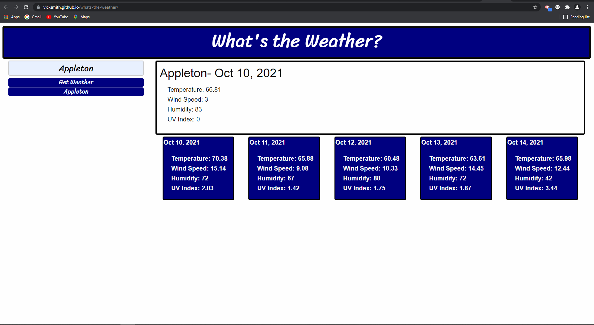

# What's the Weather?
[That's the Weather?](https://vic-smith.github.io/whats-the-weather/)
## Task = create an interactive weather app.

-The first thing I did was a mock-up of the landing page.
-Next I wrote a fetch call to retrieve latitude and longitude for cities searched.
-I nested a second fetch call using the coordinates returned from the first to retrieve json data.
-The data is displayed added to the html.
-A for-loop is used to display the five cards that contain the future forecast.
-The searched city name is save to local storage and then returned in the form of a button.

### Things to fix:
-I need to clear the form after submit.
-Add color-coded UV index and icons.

